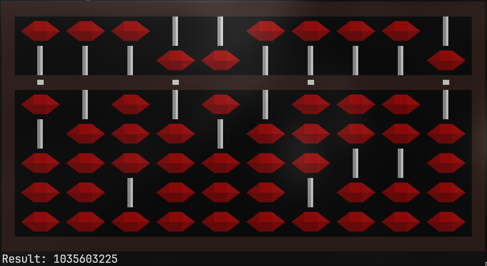

# js-soroban-cli

Terminal base Soroban with [INK (React JS in terminal)](https://www.npmjs.com/package/ink)

## Screenshot



## Installation

### 1. Clone project

```bash
git clone https://github.com/TohidEq/js-soroban-cli.git
cd js-soroban-cli
```

### 2. Install Packages

```bash
npm i
```

### 3. Build and Use

```bash
npm run build
chmod +x ./dist/cli.js

js-soroban-cli
```

If it has `not executable file ERROR` you can:

```bash
$ whereis js-soroban-cli
>> js-soroban-cli: /home/tohid-eq/.local/share/nvm/v22.9.0/bin/js-soroban-cli
```

and make it executable with:

```
chmod +x /home/tohid-eq/.local/share/nvm/v22.9.0/bin/js-soroban-cli
```

# Keys

### EZ Keys

```
` >> Exit
= >> Calculate Result

TAB >> Top Beads Select(Fives)
```

### Base Keys

- cols...

```

0-p-;-/ >> First Column Right to Left
9-o-l-. >> seccond Column rtl
...
1-q-a-z >> Last Coloumn rtl
```

### +5 -5

```
First tab, then use a number
TAB >> 1-2-3-4-5-6-7-8-9-0  >>  Toggle Top Beads Value (Fives)
```

### +- 1 2 3 4

```
1-2-3-4-5-6-7-8-9-0 >> Plus 1
q-w-e-r-t-y-u-i-o-p >> Plus 2
a-s-d-f-g-h-j-k-l-; >> Plus 3
z-x-c-v-b-n-m-,-.-/ >> Plus 4

Hold shift and use keys
Shift + 1-2-3-4-5-6-7-8-9-0 >> Minus 4
Shift + q-w-e-r-t-y-u-i-o-p >> Minus 3
Shift + a-s-d-f-g-h-j-k-l-; >> Minus 2
Shift + z-x-c-v-b-n-m-,-.-/ >> Minus 1
```
